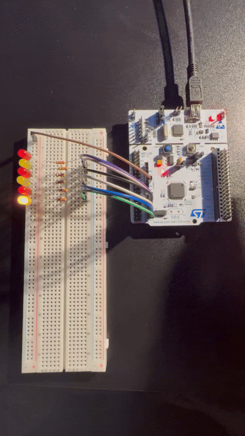

# STM32-Nucleo-LED-Sequencer
Interactive LED animation with hardwere debouncing on Nucleo-F411RE.

# STM32 Nucleo-F411RE: Interactive LED Sequencer

## Project Demo
The sequence changes direction when the onboard USER button (PC13) is pressed.

## Overview
This repository contains a simple C project for the STM32 Nucleo-F411RE board. It controls 6 external LEDs in a "knight rider" sequence. A software debounced button press changes the animation direction.

## Key Technical Features
* **HAL Library:** Used for efficient hardware abstraction.
* **Array-based GPIO:** LEDs are mapped using C arrays of structures for better code maintainability.
* **Software Debouncing:** A non-blocking delay ensures reliable button press detection.
* **Polling-based UI:** The button state is polled within animation loops for high responsiveness.

## Hardware Setup
* STM32 Nucleo-F411RE
* 6x LEDs with 330 Ohm resistors
* Breadboard and jumper wires

## How to Compile
1.  Clone this repository.
2.  Open the `.ioc` file in STM32CubeIDE.
3.  Build and flash to your board.
